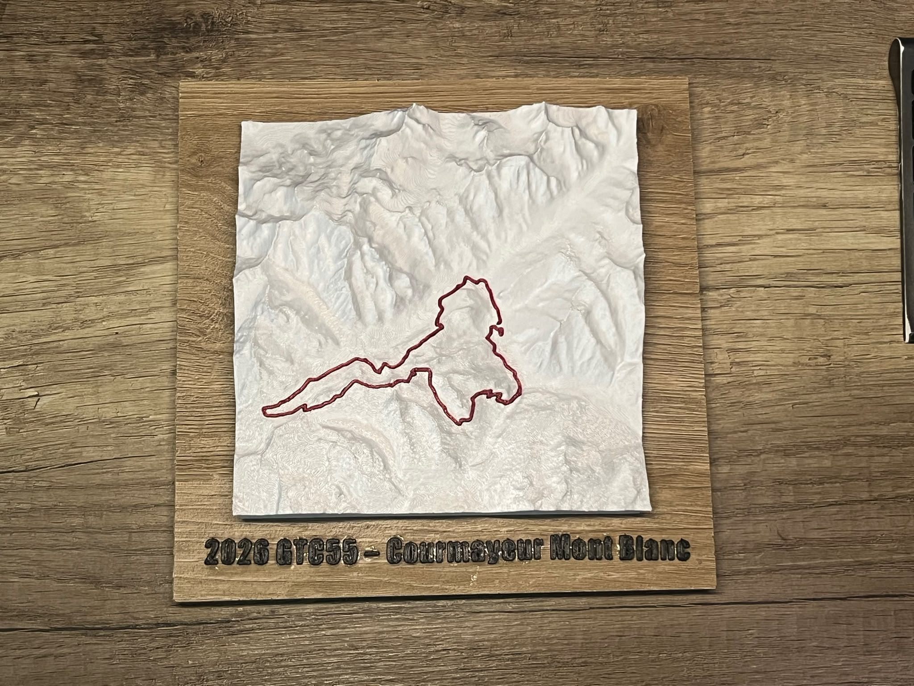
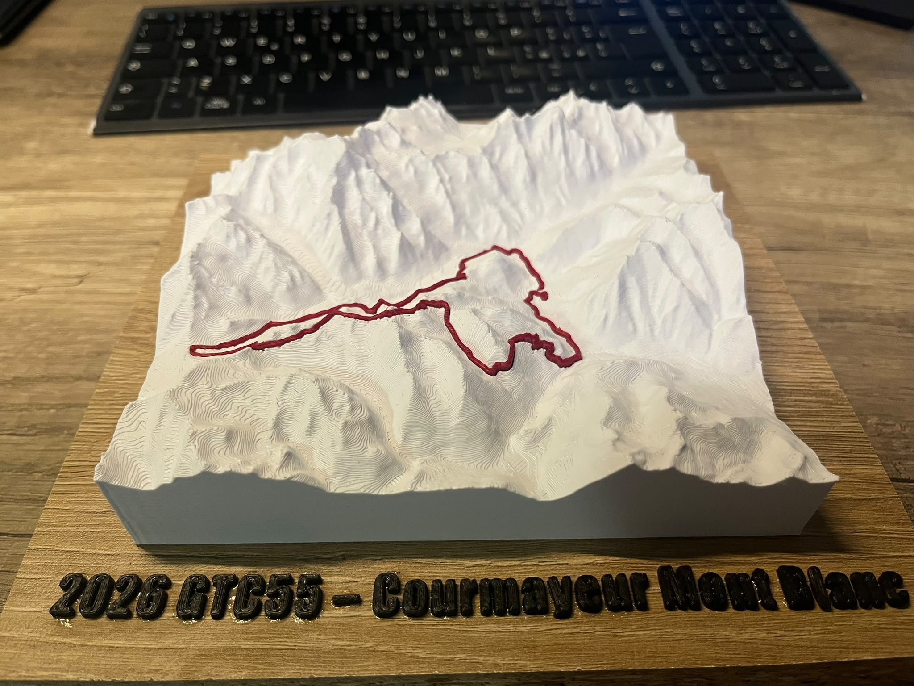
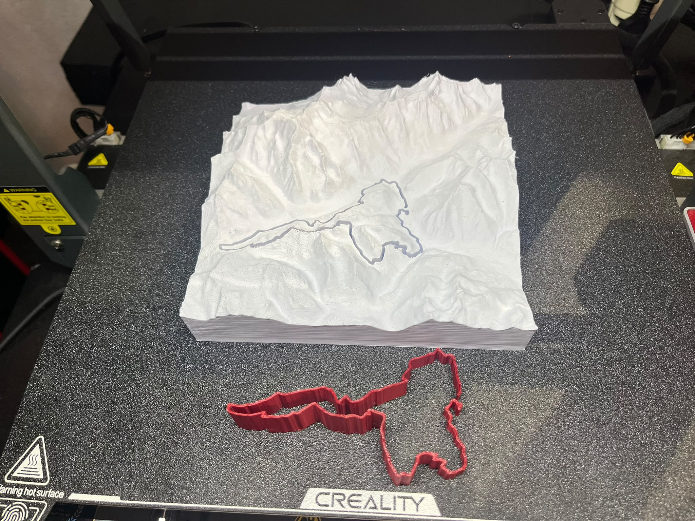
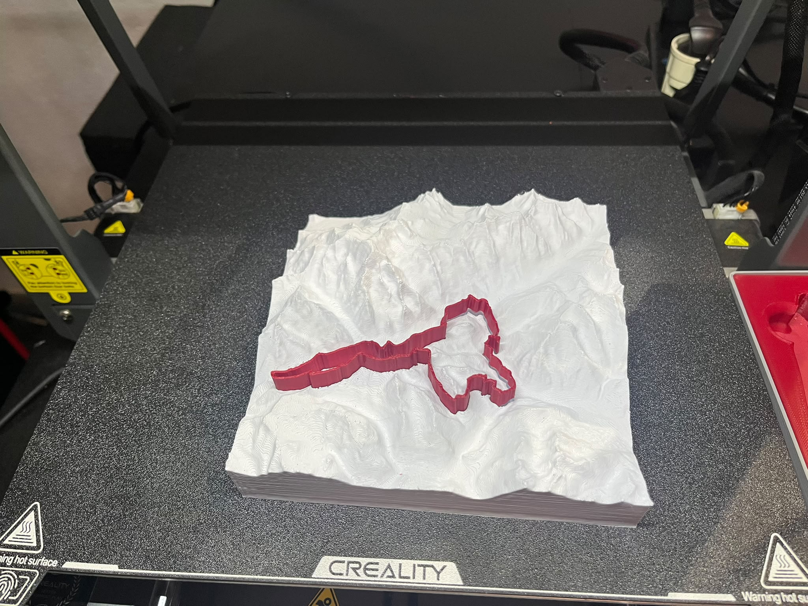

# 3D Trail Run

Generate printable 3D STL terrain models of trail running routes, in the style
of alpine relief plaques (*alpen-werk #RB60*). The GPS track is embedded into
the model either as an incised groove (approach A) or as a coloured inlay insert
printed separately (approach B).

## Results



*Finished piece — approach B. The GPS track is a separately printed red insert
seated in a recess in the white relief, and the label letters are glued to the
oak base with the runner snapped off and discarded.*



*Side view. The vertical exaggeration is 1.3, and the flat plinth under the
terrain is what the model stands on.*

| Two pieces off the bed | Insert seated in the recess |
|---|---|
|  |  |

The recess and the insert are level sets of the same distance field, which is why
the insert drops in along its whole length — including the switchbacks — at a
uniform 0.125 mm clearance per side.

## Reference case

**Gran Trail Courmayeur (GTC)** — 55.66 km, ~3,066 m elevation gain, Mont Blanc
massif, Valle d'Aosta.

## Approaches

| | Approach A — Incised track | Approach B — Inlay (two pieces) |
|---|---|---|
| Script | `rilievo3d_v1.py` | `rilievo3d_intarsio.py` |
| Output | single STL, groove coloured by hand | relief STL + track STL, different filaments |
| Status | **completed and printed** (180 mm) | **completed and printed** (150 mm) |

See [docs/project_handoff.md](docs/project_handoff.md) for the full design
history, parameters, known errors, and validation results, and
[CHANGELOG.md](CHANGELOG.md) for the running log of changes and decisions.

## Labels

`etichetta3d.py` generates the name label that goes on the model or on a wooden
base. It is not a name plate: every letter is a separate solid with nothing
behind or between the letters. A straight runner above the text reaches each
letter through a post ending in a thin snap notch, so the label is handled and
glued as one piece and the runner is then broken off, leaving only the letters.

```bash
python3 etichetta3d.py --fit --max-len 180   # solve cap height for an 18 cm label
python3 etichetta3d.py --part letters        # letters only
python3 etichetta3d.py --cap 6.5             # explicit cap height
```

`--fit` solves for the largest cap height that fits the budget. It is not a
ratio: `MIN_GAP` is absolute, so the air gaps take a growing share of the width
as the letters shrink (0.47 mm of added tracking at 180 mm, 3.35 mm at 100 mm).

The front-face chamfer is a distance-field roof, `z = min(depth, depth - chamfer
+ d)`, not an inward polygon offset: the narrowest neck in the GTC55 text is
0.39 mm, so a 0.40 mm inset per side would collapse the front face. The roof
degrades into a ridge where the glyph is narrow instead of self-intersecting.

Font choice is driven by the *counters* (the enclosed holes in `a e o B 0 6`),
not by stroke width — below roughly 0.45 mm a counter closes up while printing
and the letter reads as a solid blob. At 100 mm the narrowest counter is 0.40 mm,
under one 0.42 mm bead, which is why the GTC55 label was not kept that small.

| Version | Cap | Narrowest neck | Narrowest counter | Bulk stroke |
|---|---|---|---|---|
| 126 mm | 6.50 mm | 0.39 mm | 0.48 mm | 1.6–2.3 mm |
| **180 mm** | **9.32 mm** | **0.56 mm** | **0.69 mm** | **2.3–3.3 mm** |

Glyph scaling is uniform, so those feature sizes scale exactly linearly with cap
height and do not need re-measuring per size.

## Output convention

Every generated STL goes in a per-project subfolder of `3d-outputs/`:

```
3d-outputs/GTC55-2026/GTC55-2026_label_180mm.stl
```

The total length is part of the filename so several sizes coexist.

STL files are build artefacts (~10 MB each) and are not tracked in git.

## Quick start (Approach A)

```bash
# Preview framing
python3 rilievo3d_v1.py --gpx your_track.gpx --hgt-dir ./hgt --preview

# Generate STL
python3 rilievo3d_v1.py \
  --gpx your_track.gpx --hgt-dir ./hgt \
  --bbox 45.7010 45.8988 6.7880 7.0713 \
  --size 180 --vex 1.3 --plinth 12 \
  --out model.stl
```

## Data

SRTM 1 arcsecond `.hgt` tiles are required and are **not** included in the repo
(binary, ~25 MB each). Place them in `./hgt/`:

```
hgt/N45E006.hgt
hgt/N45E007.hgt
```

Mirror: `https://raw.githubusercontent.com/danielementary/Alpano/master/NxxEyyy.hgt`

## Dependencies

```
numpy scipy matplotlib
```

No CAD libraries (no trimesh, shapely, open3d, CGAL). Meshes are built and
validated entirely from scratch.

## License

MIT
